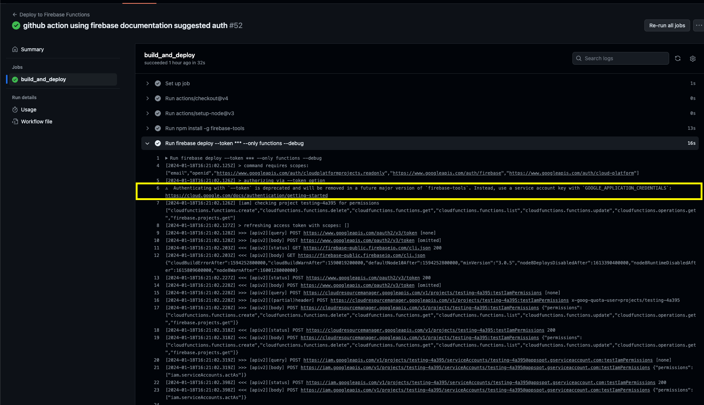

Firebase makes getting started really simple and you can have an app up in no time utilizing pretty powerful google cloud based resources that scale to the moon! On the hosting end one of my favorite features is hosting channel deployment on PR (including updates with new commits to a PR) and live channel deployment when you merge a pr to your main branch.
```
firebase init hosting:github
```
To learn more about this check out the [firebase hosting docs](https://firebase.google.com/docs/hosting).

Firebase CLI doesn't provide a similar tool to automate the process of deploying firebase functions, so we need to write our own Github action.

## Creating The Github Action
This post assumes you are familiar with firebase functions and have setup your development enviornment as described in the [cloud functions getting started docs](https://firebase.google.com/docs/functions/get-started?gen=2nd), have a firebase project you're working on and have git setup with a remote origin pointing to a valid github repo.

Additionally, the Github acction depends on all dependency management being handled by firebase predeploy scripts stored in the `firebase.json` file:
```
{
  "functions": [
    {
      "source": "functions",
      "codebase": "default",
      "ignore": [
        "node_modules",
        ".git",
        "firebase-debug.log",
        "firebase-debug.*.log"
      ],
      "predeploy": [
        "npm ci --prefix \"$RESOURCE_DIR\"",
        "npm --prefix \"$RESOURCE_DIR\" run build"
      ]
    }
  ]
}
```
I like to use the predeploy scripts for the dependency installation and build becuase we can cound on the path being correct with the `$RESOURCE_DIR` variable made available by firebase when those scripts are run.

Before diving into writting the custom action it's helpful to paln out the steps required to deploy. We can think this through based on how we'd manually deploy. It's important to remember that we'll be deploying from a fresh instance, so things that we might have done a while ago, like authentication, will need to be considered.
Manual deployment steps:
- Install Firebase CLI
- Authenticate Firebase CLI
- Install the dependencies (handled in the `firebase.json`)
- Run the build script (handled in the `firebase.json`)
- Run the `firebase deploy` script

With those consideration here is the github action we can use:
```
name: Deploy to Firebase Functions
'on':
  push:
    branches:
      - main
jobs:
  build_and_deploy:
    runs-on: ubuntu-latest
    steps:
      - uses: actions/checkout@v4
      - uses: actions/setup-node@v3
        with:
          node-version: '18'
      - run: npm install -g firebase-tools 
      - run: firebase deploy --token ${{ secrets.FIREBASE_TOKEN }} --only functions --debug
```

Notice how the `steps` block aligns with the planned out steps! There are a few things we didn't consider in our manual deployment process that needed to be handled. We have to checkout the code and setup node. Both of these steps can be handled by other Github actions that we just include in ours with `uses`.

The above example follows the firebase CLI documentation for [using the CLI with CI systems](https://firebase.google.com/docs/cli#cli-ci-systems) to authenticate. The docs outline the following steps to authenticate for CI systems:
- Obtaining a refresh token locally by running `firebase login:ci`
- Storing that token as a secret in your CI system
- Use the token when running `firebase` commands by:
    - Option 1: Storing the token as the environment variable `FIREBASE_TOKEN`. The system will automatically use the token.
    - Option 2: Fun all `firebase` commands with the `--token <FIREBASE_TOKEN>` flag in the CI system.

The above example follows **option 2**, but either would work.

Following this process works, but you'll notice a warning in the Github action logs:

You'll also get the warning if you try following **option 1** and setting the `FIREBASE_TOKEN` as an environment variable.

To future proof our action we can switch to authenticating with a service account as suggested by the warning. Similar to the **option 1** approach, to use service account authentication we just need to set the `GOOGLE_APPLICATION_CREDENTIALS` environment variable that the firebase CLI will use to authenticate.
There are multiple ways to setup a service account, we'll do everything in the google cloud console gui.
1. Go to the [Google Cloud Console](https://console.cloud.google.com/) and select your project.
2. Click **Create Service Account** and enter the service account details.
3. Click **Create and Continue**
4. Add the **Firebase App Distribution**, **API Key Viewer**, and **Cloud Functions Service Agent** roles and click **Done**.
5. Create a private JSON key and move the key to a location accessible to your build environment.*Be sure to keep this file somewhere safe*, because it grants administrator access to App Distribution in your Firebase project. 

In github store the JSON key from step 5 above as an action secret. You can use any name you'd like, but I use `FIREBASE_SERVICE_ACCOUNT`.

Finally, we'll use the [google-github-actions/auth](https://github.com/google-github-actions/auth) github action provided by google to handle the authentication process in our action and remove the use of the `--token` flag.
```
name: Deploy to Firebase Functions
'on':
  push:
    branches:
      - main
jobs:
  build_and_deploy:
    runs-on: ubuntu-latest
    steps:
      - uses: actions/checkout@v4
      - uses: actions/setup-node@v3
        with:
          node-version: '18'
      - run: npm install -g firebase-tools 
      - uses: 'google-github-actions/auth@v2'
        with:
          credentials_json: '${{ secrets.FIREBASE_SERVICE_ACCOUNT }}'
      - run: firebase deploy --only functions --debug
```

With this, the function should no deploy when you push commits to the main branch!

## Next Steps
This post handles setting up a Github action to run when you merge code into your main branch. For most applications, it is generally a good idea to setup a staging and/or development enviornment. Using the above Github action as a starting point we could quickly make a new action to handle deploying functions to a staging project when a pull request is made.
```
name: Deploy to Firebase Functions Staging on PR
'on': pull_request
jobs:
  build_and_deploy_to_staging:
    if: '${{ github.event.pull_request.head.repo.full_name == github.repository }}'
    runs-on: ubuntu-latest
    steps:
      - uses: actions/checkout@v4
      - uses: actions/setup-node@v3
        with:
          node-version: '18'
      - run: npm install -g firebase-tools 
      - uses: 'google-github-actions/auth@v2'
        with:
          credentials_json: '${{ secrets.FIREBASE_SERVICE_ACCOUNT_STAGING }}'
      - run: firebase deploy --only functions --debug
```

We only had to make this action deploy our code to a new environment on each pull request.
- use `'on': pull_request`
- add the `if` to make sure that a PR from a forked repo isn't accidentally deployed
- create and use a new service account token for the new environment.

